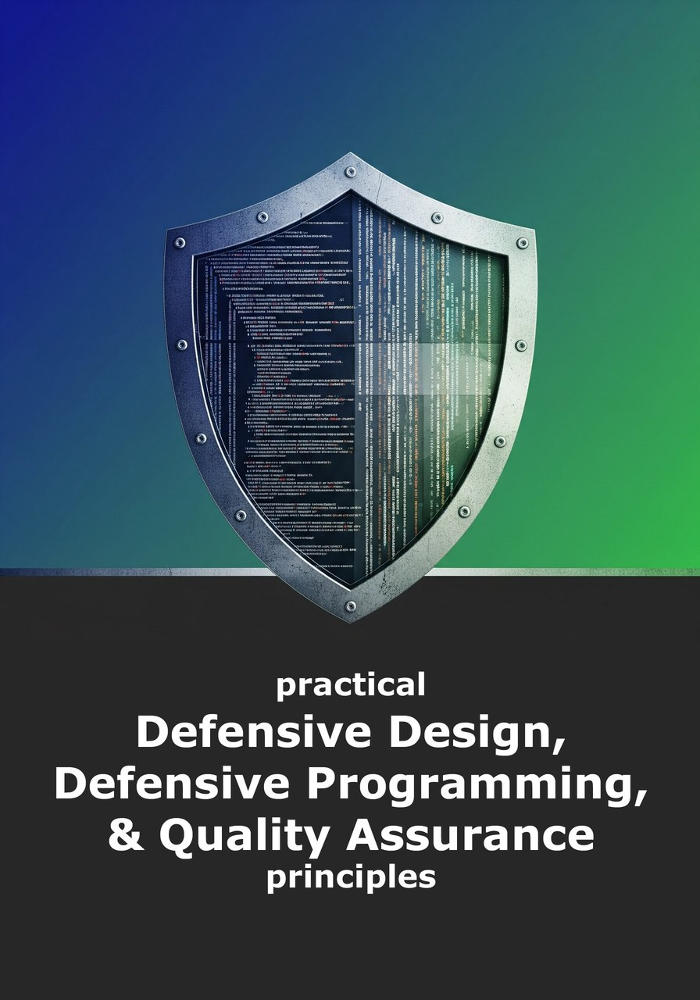

# Practical Defensive Design, Defensive Programming, and Quality Assurance principles
This repository contains some of the code samples, diagrams and materials of the book _["Practical Defensive Design, Defensive Programming and Quality Assurance principles"](https://www.amazon.it/dp/B0FTMRDW33)_

**Defensive Design**, **Defensive Programming** and **Quality Assurance** are vast, multi-faceted, complex topics with deep historical roots and significant ramifications across multiple aspects of IT.

  

**Defensive Programming** is a software development technique designed to improve the robustness and reliability of code. It’s about anticipating potential problems and implementing safeguards to prevent them, in order to improve, and potentially guarantee, User Safety, Cybersecurity, System Integrity, Privacy and Data Confidentiality.

**Defensive Design** is its counterpart at a higher abstraction level, and involves creating infrastructures and architectures able to host and run code created with the Defensive Programming principles. As the two faces of the same medal, they both involve many different aspects of programming and different strategies, depending on the kind of application, and the technologies used to create it.

**Quality Assurance** is the means by which a consistent and unified work methodology is achieved for all its principles. Defensive Design, Defensive Programming and Quality Assurance are practically inseparable; one cannot be effectively maintained long-term without the other.

If you are interested, you can [buy the book on Amazon](https://www.amazon.it/dp/B0FTMRDW33)
 

# Topics
The topics treated in the book are the following:

**Section 1: General principles and landscape** 

1. Defensive Design and Defensive Programming core principles
2. KPIs (Key Performance Indicators)
3. System health
4. Cybersecurity misconceptions
5. The “Defense in Depth” principle

**Section 2: Defensive Design & Defensive Programming** 

6. Anticipating errors and anomalies 
7. Graceful error handling 
8. Enhancing robustness and resilience 
9. Input validation 
10. Automated testing 
11. Assertions 

**Section 3: Cybersecurity** 

12. Cybersecurity is a first-class citizen 
13. Cybersecurity posture 
14. Cybersecurity rules of thumb 
15. Software Bill Of Materials (SBOM) 
16. SemVer 2.0 
17. Knowledge bases and data formats 
18. IEC 62443 
19. Authentication vs Authorization 
20. Security models, schemas, domains 
21. Notable laws and regulations 
22. Cyber Resilience Act (CRA) 

**Section 4: Quality Assurance** 

23. Quality Assurance principles 
24. VCS and code branch management 
25. Structured commits messages 
26. SAST & DAST 
27. The STRIDE and DREAD-D frameworks 
28. Software Development Lifecycle (SDLC) 
29. Secure Software Development Lifecycle 
30. CI/CD 

**Section 5: Good practices, Bad practices, and everything in-between** 

31. Adopting the proper mindset 
32. Embrace the power of D.D.D. 
33. Architecture and high-level design 
34. Low-level modeling and coding best practices 
35. Your data is sacred 
36. Evolving the system 
37. Thinking like a defender 
38. All Hands, Safe and Sound 

